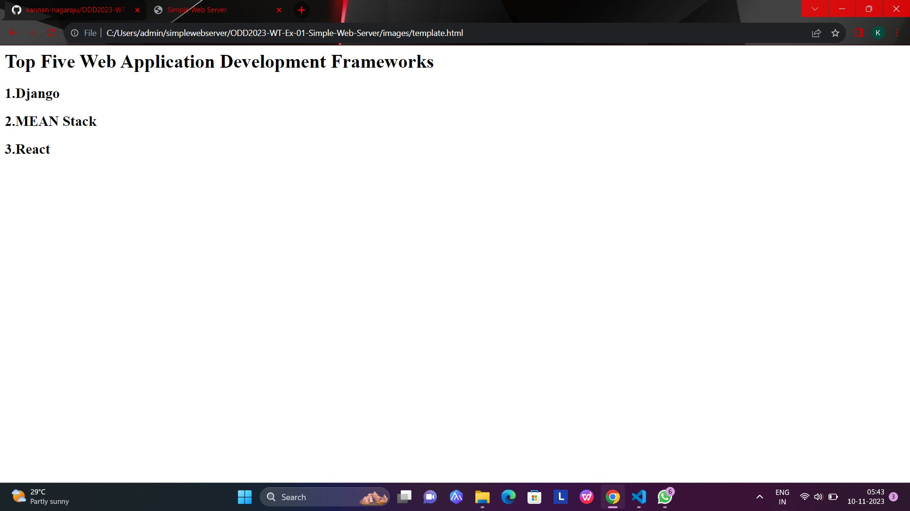

# Ex-01-Simple-Web-Server
## Date:10.11.23
## Name:N Kannan

## AIM:
To develop a simple webserver to serve html pages.

## DESIGN STEPS:
### Step 1: 
HTML content creation.

### Step 2:
Design of webserver workflow.

### Step 3:
Implementation using Python code.

### Step 4:
Serving the HTML pages.

### Step 5:
Testing the webserver.

## PROGRAM:

``````
from http.server import HTTPServer, BaseHTTPRequestHandler

content = ""
<html>
<head>
<title>Simple Web Server</title>
</head>
<body>
<h1>Top Five Web Application Development Frameworks</h1>
<h2>1.Django</h2>
<h2>2.MEAN Stack</h2>
<h2>3.React</h2>
</body>
</html>
"""
 class HelloHandler(BaseHTTPRequestHandler):
 def do_GET(self):
        self.send_response(200)
        self.send_header('Content-type', 'text/html; charset=utf-8')
        self.end_headers()
        self.wfile.write(content.encode())

server_address = ('', 80)
httpd = HTTPServer(server_address, HelloHandler)
httpd.serve_forever()
``````


## OUTPUT:



## RESULT:
The program for implementing simple webserver is executed successfully.
